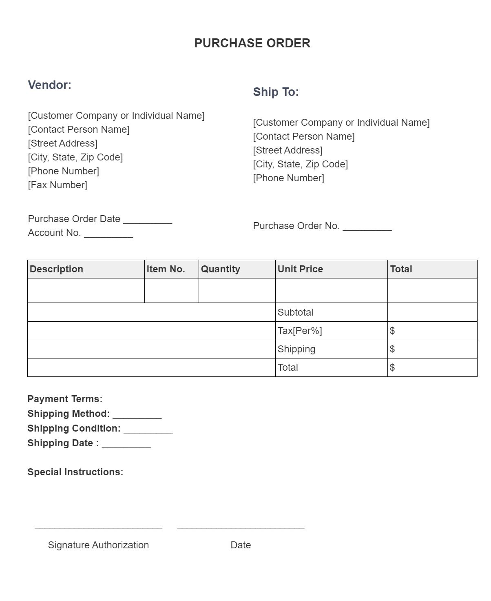

now we are going to create the mechanism for the Construction Service having the same mechanism as trucks negotiation which has been implemented.
# Construction Service Negotiation
## Backend
1. in the models folder create a new schema for Construction Service negotiation which consist of the following fields:
   1. buyer: id ref(user)
   2. seller: id ref(user)
   3. constructionService: id ref(constructionService)
   4. constructionServiceDescription: string
   7. buyerAddress: string
   8. buyerCity:string
   9. negotiation:[{
      negotiator:string enum('buyer','seller')
      labourCharges:number
      duration:{fromDate:date,toDate:date}
      milestones:[{
         dueDate:date,
         dateOfCompletion:date 
         isCompleted:boolean default(false), 
         charges:number
         paymentStatus string enum('unpaid', 'pendingApproval','paid') default 'unpaid'
         paymentStatusRejectionReason
         paymentScreenshots:[{url:string}]
         }]
      accepted:boolean default false
      }]
   10. advanceStatus:string enum('unpaid', 'pendingApproval','paid') default 'unpaid'
   11. advanceStatusRejectionReason: string
   12. advancePaymentScreenshots:[{url:string}]
   13. finalPaymentStatus:string enum('unpaid', 'pendingApproval','paid') default 'unpaid'
   14. finalPaymentStatusRejectionReason:string
   15. finalPaymentScreenshots:[{url:string}]
   16. purhcaseOrderDate: Date
2. in the routes folder, create the respective route file for constructionServiceNegotiation to manage its crud endpoints.
## Frontend
## User Dashboard
1. In the user dashboard, add a new tab of My Negotiations in the sidebar which takes the user to the My Negotiations page of the user dashboard.
2. the ui of the my negotiations page is similar to the ui of the My Listings page.
3. clicking on the Construction Service negotiation will take the user to the construction-service-negotiations page whose ui is similar to Construction Services listing page.
In the Construction Services negotiation page it will fetch and show all the negotiations whose buyer or seller field matches the logged in user id.
4. Clicking on the view button will take the user to the /construction-service-negotiation/:constructionServiceNegotiationID dynamic route which is described below in next point.

## Construction Service Details Page
1. [Construction ServiceDetailsSidebarCards.jsx](/Users/mac/gitRepos/sbc-marketplaced/Custom-ReactJS-Workflow/src/components/marketplace/Construction ServiceDetailsSidebarCards.jsx) write Offer Construction Service instead of Offer Amount.
2. remove the message textarea in the submit your offer card.
4. add text area input for constructionServiceDescription
5. two date pickers for fromDate and toDate as per the duration field of construction serivce negotiation schema

6. In the select delivery type there should be only 1 button of On-Site pre selected then below the buttons, 1 city dropdown, 1 text input for Buyer City and Buyer Address (as per the Construction Service negotiation schema)

8. when clicking on submit offer button then it should open a bootstrap confirmation modal saying that are you sure you want to submit an offer etc. 
   1. When the user clicks on submit then it should create a Construction Service negotiation with the provided information.
   2. make sure the UI of the confirmation modal matches the UI and theme of the website.
   3. after clicking the submit button the Construction Service negotiation document should be created as follow:
      1. the create Construction Service negotiation endpoint uses the authtoken middleware by which we can get the user id and use it in the buyer field.
      2. the seller id comes from the respective Construction Service listing document.
         1. from the frontend the Construction Serviceid is sent in the req.body, so inside the endpoint using the Construction Serviceid you retrieve the Construction Service document from whcih you can retrieve the sellerid.
      3. the Construction Serviceid is sent in the req.body from the frontend
      5. the buyerAddress, buyerCity will also be sent in the req.body from the frontend to be used in the endpoint.
      6. at the time of Construction Service negotiation creation, in the negotiation array, 1 object will be added where
         1. negotiator will be 'buyer'
         2. fromDate and toDate of the duration will be taken from the offer form.
         3. labourCharges will be 0
        
      7. the rest of the fields of the Construction Service negotiation document should be null/default
   4. when a negotiation is submitted then it should navigate the user to the Construction Service-negotiation/:Construction ServicenegotiationID dynamic route of the user dashboard.
   5. The UI of the negotiation sceen should follow the UI of the figma design: [SBC Marketplace UI 1.0 Copy](https://www.figma.com/design/uJ82aUAo9qF9dUIBSw4lNP/SBC-Marketplace-UI-1.0--Copy-?node-id=249-2976&t=Q68W0nWhC32fdKID-4)
   Here it will render all the negotiations of the negotiation array of the Construction Service negotiation object.
   6. instead of showing 1 enter your offer input, there should be a counter offer button.
   7. Clicking the counter offer button will open a bootstrap model for Submit Counter offer, which consists of the following inputs:
      1. Labour Charges Number input
      2. from date and to date date pickers for duration
      3. Milestones:
         there should be Add Milestones and Remove Milestones button that can be used to add or remove milestones item for the milestones array.
         Each Milestone item should be as follow:
            1. Date picker for dueDate
            2. charges number input
            3. remove (x button) popover to remove the milestone item
      Clicking on the Submit button of the counter offer modal will add another negotiation object with the provided information.
      If the counter offer is submitted by buyer to the negotiatior will be buyer.
      If seller then it will be seller.
   8. With each negotiation of the counter party, there should be a Accept button with each of them.
   9. Clicking the accept button will make the accepted boolean true of the respective negotiation offer.
   10. Once a negotiation is accepted then the Pay Advance Fee section will become visible having the following UI: [SBC Marketplace UI 1.0 Copy](https://www.figma.com/design/uJ82aUAo9qF9dUIBSw4lNP/SBC-Marketplace-UI-1.0--Copy-?node-id=253-3090&t=Q68W0nWhC32fdKID-4) .
   11. In the Pay Advance Fee Section:
       1. leave the Pay Online button unused for now.
       2. Show the Construction Service Cost and Delivery Cost.
       3. Show the Amount of Advance Fee
          1. The Advance fee is calculated as follows:
             (labourCharges)*advancePercentage
          The advancePercentage comes from the basic info which admin has controlled.
       4. Show the Platform Fee
          1. The Platform fee is calculated as follows:
             Advance Fee*platformFeePercentage
          The platformFeePercentage comes from the basic info which admin has controlled.
       5. Show the Total Amount to be paid
          The Total amount is the sum of Advance and Platform Fee.
       6. clicking the Upload Payment Proof button will open the Upload Payment Proof bootstrap modal having the image upload and image preview mechanism just like listing creation.
       7. after clicking on Submit, These images will become part of the advancePaymentScreenshots array and the advanceStatus will change from unpaid to pendingApproval.
       8. once the status has been changed to paid by the admin then this section will now become invisible just like negotiations and now this Final Payment section will be visible following the UI of the figma design: [SBC Marketplace UI 1.0 Copy](https://www.figma.com/design/uJ82aUAo9qF9dUIBSw4lNP/SBC-Marketplace-UI-1.0--Copy-?node-id=253-3171&t=Q68W0nWhC32fdKID-4).
       9. if the milestones array is not empty then on top of the final payment section show the Milestones in a bootstrap progress bar also tailor it as per the ui of the website.
         The Progress bar works as follows:
            1. it shows all the milestones
            2. the progress of the progress bar increases and covers the milestones whose isCompleted is true.
       10. In this final payment section it will show the following amounts: 
         (in case of no milestone)
          1. Agreed Construction Service Cost=labourCharges
          3. Agreed Total Cost = Construction Service
          4. Advance Fee Paid= Yes
          5. Advance Fee Amount = Agreed Total Cost *advancePercentage
          6. Platform Fee = Agreed Total Cost *platformFeePercentage
          7. Amount to be Paid= agreed total cost - advanceFeeAmount + platform fee
         (in case of milestone) it shows the first milesstone object whose isCompleted is false.
          1. Agreed Construction Service Cost=milestones[].charges
          3. Agreed Total Cost = milestones[].charges
          6. Platform Fee = Agreed Total Cost *platformFeePercentage
          7. Amount to be Paid= agreed total cost + platform fee
       the same mechanism applies for the upload payment proof just like Advance Fee, and clicking the submit button in the modal will make the images part of the milestones[].paymentScreenshot array and finalPaymentStatus will change to pendingApproval.
       11. once the finalPaymentStatus is approved or all the milestones are completed then it should update the purchaseOrderDate to the current date and it will show negotiation successful and a Purchase Order will be visible which consist of the following informations:
          1. The Strucutre of the Construction Service Purchase Order should be similar to the reference purchase order image .
          2. the UI of the purchase order should be designed as per the sbc theme and should have sbc logo
          3. The following described information which the purchase order will show will be all rendered from the respective negotiation document(these all information will be taken from the respective negotiation document and use .populate for populating the ids) 
          4. In place of Vendor it should be Buyer
             1. In this column the following info should be visible:
                1. Full Name
                2. Address
                3. City, State, Zip Code
                4. Phone Number
                   the respective fields are added in the [user.js](/Users/mac/gitRepos/sbc-marketplaced/Custom-ReactJS-Workflow/server/models/user.js) 
                   so wire them up with the user dashboard as follows:
                   1. In the user dashboard, add a new tab of basic info in the sidebar which takes the user to the basic info page of the user dashboard.
                  2. The UI of the basic info page is simple, where it should render and prefill the following basic info fields in text, dropdown and number inputs as per the user schema fields.
         5. In place of Ship To it should be Seller which should also render the same information of the seller the similar way as it is rendered for the user.
         6. In Purchase Order Date render the purhcaseOrderDate.
         7. The item table should consist of the following columns:
            1. Title (render the Construction Service title)
            2. Category (render the category name of the Construction Service)
            5. Construction Service cost
            In the last(total column) and second last column of the table show the following breakdown:
             1. Subtotal=labourCharges
         2. Delivery Cost = deliveryCost
          3. Advance Fee Amount = (labourCharges+deliveryCost)*advancePercentage
          4. Platform Fee = (labourCharges+deliveryCost)*platformFeePercentage
          5. Total= (labourCharges+deliveryCost) + platform fee
          6. after the table in place of the Payment Terms, it should be Delivery Details
            1. On-Site Service: "Provided" if onSitge is true otherwise it should be "Not Provided"
            2. On-Site Location: buyerAddress
            3. On-Site City: buyerCity
         7. Next write some hardcoded Special instructions of SBC Marketplace Purchase order.
         8. thats it for the purchase order.
      12. if the negotiator is seller then under each milestone the user can update the milestone status by clicking on update which will open a bootstrap modal which shows a dropdown for isCompleted yes or no.
      If the seller selects yes, then it marks the isCompleted true for that respective milestone and also adds the current date to the date of completion.
## Admin Dashboard
1. In the admin dashboard, add a new tab of View Negotiations in the sidebar which takes the admin to the View Negotitions page of the admin dashboard.
2. The UI of the Negotiations page should be similar to the Ui of View listings, when the Admin clicks on the Construction Services Negotiation then it should navigate the admin to the Construction Service-neogtiations page.
3. The UI of Construction Service Negotiations page is also similar to Construction Services Lisitng page whcih will render all the negotiations of all the Users.
4. Clicking on the view button of a particular Construction Service negotiation will take the admin to the negotiation-detail/:Construction ServiceNegotiationID.
5. The UI of the Construction Service negotiation detail page will follow the UI of the admin dashboard where it will render all the information of the respective Construction Service negotiation.
6. In the Construction Service negotiation detail page, the admin can change the status from the dropdown of advanceStatus and finalPaymentStatus.
7. After changing the statuses, the admin can hit the Update button to edit the changes.

      

2. in the routes folder, create the respective route file for basic info to manage its crud endpoints.

1. [UserConstructionServiceNegotiationDetailPage.jsx](/Users/mac/gitRepos/sbc-marketplaced/Custom-ReactJS-Workflow/src/components/dashboard/user/UserConstructionServiceNegotiationDetailPage.jsx) use bootstrap collapse for the construction service requirements, pressing the view details button will expand the collapsable.
2. [UserConstructionServiceNegotiationDetailPage.jsx](/Users/mac/gitRepos/sbc-marketplaced/Custom-ReactJS-Workflow/src/components/dashboard/user/UserConstructionServiceNegotiationDetailPage.jsx) do not use custom grid in the modal, use bootstrap row cols etc.
   Use the same UI of modal as used in [UserRentalTruckNegotiationDetailPage.jsx](/Users/mac/gitRepos/sbc-marketplaced/Custom-ReactJS-Workflow/src/components/dashboard/user/UserRentalTruckNegotiationDetailPage.jsx) 
3. [AdminConstructionServiceNegotiationDetailPage.jsx](/Users/mac/gitRepos/sbc-marketplaced/Custom-ReactJS-Workflow/src/components/dashboard/admin/AdminConstructionServiceNegotiationDetailPage.jsx) just like the view conversation collapse, if there are milestones so there should be a collapse for view milestones, clicking on it should expand the milestones.
   1. Each milestone should have a Payment status dropdown and rejection reason the same way as it shows in the advance payment and final payment section
      1. [constructionServiceNegotiation.js](/Users/mac/gitRepos/sbc-marketplaced/Custom-ReactJS-Workflow/server/models/constructionServiceNegotiation.js) a new field of paymentstatusrejection is added so also wire it up.

         